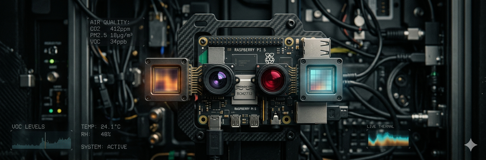

<p align="center">
  
</p>

<h1 align="center">Argus</h1>
<p align="center"><strong>Physical senses for AI agents on any laptop</strong></p>

<p align="center">
  <a href="https://github.com/buckster123/Argus/releases"></a>
  <a href="https://github.com/buckster123/Argus/actions"></a>
  <a href="https://github.com/buckster123/Argus/blob/main/LICENSE"></a>
</p>

---

## What is Argus?

AI agents are brilliant. But they are usually locked inside a terminal, blind to the world around them.

**Argus fixes that.**

This is an MCP-connected sensor array that plugs real-world perception directly into any AI agent session. Point your laptop webcam at something. Ask your agent what it sees. Let it hear the room. Let it read its own system health. All through a clean, discoverable plugin architecture.

It's senses. For your agent. On any laptop.

---

## Screenshot

<p align="center">
  
</p>

---

## Built-In Sensors

| Sensor | What it does | Hardware required |
|--------|-------------|-------------------|
| 📹 **Webcam** | Capture photos, stream video | Any laptop webcam |
| 🎤 **Audio** | Record microphone clips | Any laptop mic |
| 🖥️ **Screen** | Screenshot the primary monitor | Any display |
| 🧠 **System** | CPU, memory, disk, battery, temperature | None |

All four work on any modern laptop with **zero configuration**.

### Coming soon (stubs ready)

| Sensor | Hardware | Price range |
|--------|----------|-------------|
| 🌡️ **USB Thermal** | FLIR Lepton, Seek Thermal | $50–200 |
| 🌬️ **Environmental** | BME680/688, SCD4x, SPS30 | $20–40 |
| 📍 **USB GPS** | u-blox NEO-6M/7M/8M | $15–25 |
| ⚡ **Serial Co-processor** | ESP32/Arduino/RP2040 bridge | $10–30 |

See [`docs/PLUGINS.md`](docs/PLUGINS.md) to build your own.

---

## Architecture

```
┌──────────────────────────────────────────┐
│ Hermes / Claude / Any MCP Client │
└──────────────────────────────────────────┘
              │
              ▼
         argus-mcp
       MCP server (stdio)
              │
              ▼
    ┌──────────────────────────────┐
    │  Argus Dashboard (FastAPI)  │
    │         Port 8080            │
    └──────────────────────────────┘
              │
     ┌───────├───────├────────┐
     ▼     ▼     ▼        ▼
  Webcam  Audio  Screen   System
  (cv2) (sound) (mss)   (psutil)
```

The MCP server talks to the dashboard over localhost REST. The agent calls tools; tools call sensors; sensors return data. Simple, fast, composable.

**Plugin architecture:**

```
PluginRegistry.discover()
    │
    +-- argus.senses.webcam    → WebcamPlugin
    +-- argus.senses.audio     → AudioPlugin
    +-- argus.senses.screen    → ScreenPlugin
    +-- argus.senses.system    → SystemPlugin
    +-- argus.senses.usb_thermal        (stub)
    +-- argus.senses.usb_environmental  (stub)
    +-- argus.senses.usb_gps            (stub)
    +-- argus.senses.serial_coprocessor (stub)
```

---

## Quick Start

```bash
# Clone & install
git clone https://github.com/buckster123/Argus.git
cd Argus
python -m venv venv
source venv/bin/activate
pip install -e ".[audio]"

# Start the dashboard
argus-dashboard
# or
python -m argus
```

Open http://localhost:8080 to see your available sensors.

### Connect to an MCP client

**Claude Code:**
```json
{
  "mcpServers": {
    "argus": {
      "command": "/path/to/Argus/venv/bin/argus-mcp"
    }
  }
}
```

**Hermes:**
```yaml
mcpServers:
  argus:
    command: /path/to/Argus/venv/bin/argus-mcp
```

Then just ask:

> *"What do you see right now?"*  
> *"Take a screenshot and describe it."*  
> *"How's my laptop doing?"*  
> *"Record 5 seconds of audio."*

---

## Hermes Dashboard Plugin

Argus ships with a native Hermes dashboard tab. After enabling the plugin:

```bash
ln -sfn ~/Projects/Argus/hermes-argus-plugin ~/.hermes/plugins/hermes-argus
hermes plugins enable hermes-argus
```

The **Argus** tab appears in your Hermes dashboard with live sensor cards:

<p align="center">
  
</p>

Click **READ** on any sensor to capture data directly inside the Hermes UI.

---

## REST API

| Endpoint | Description |
|----------|-------------|
| `GET /api/status` | List available sensors and capabilities |
| `GET /api/{sensor}/read` | Single snapshot (JSON) |
| `GET /api/{sensor}/stream` | SSE live stream |
| `GET /api/{sensor}/image` | Direct JPEG (if sensor has image) |
| `GET /api/{sensor}/audio` | Direct WAV (if sensor has audio) |

See [`docs/API.md`](docs/API.md) for full reference.

---

## MCP Tools

| Tool | Description |
|------|-------------|
| `argus_webcam_capture` | Capture a photo from the webcam |
| `argus_screen_capture` | Screenshot the primary monitor |
| `argus_audio_capture` | Record microphone audio |
| `argus_system_read` | Read CPU, memory, disk, battery, temperature |

Tools are dynamically registered — only sensors that pass `probe()` get exposed.

See [`docs/MCP.md`](docs/MCP.md) for connection examples.

---

## Building a New Sensor

```python
# argus/senses/my_sensor.py
from argus.senses.base import SenseData, SensePlugin

class MySensorPlugin(SensePlugin):
    name = "my_sensor"
    capabilities = ["capture"]

    async def probe(self) -> bool:
        return True

    async def read(self) -> SenseData:
        return SenseData(
            sensor=self.name,
            data={"value": 42},
            text="Read 42 from my_sensor",
        )
```

No registration needed — `PluginRegistry.discover()` finds it automatically.

For the full guide, see [`docs/PLUGINS.md`](docs/PLUGINS.md).

---

## Testing

```bash
make test        # Full suite with coverage
make test-fast   # Skip hardware/display tests
make lint        # ruff check
```

---

## Roadmap

- [x] Universal laptop sensors (webcam, audio, screen, system)
- [x] MCP server with dynamic tool registration
- [x] FastAPI dashboard with SSE streaming
- [x] Hermes dashboard plugin
- [x] Plugin architecture + contribution guide
- [ ] USB thermal camera support
- [ ] USB environmental sensor support
- [ ] USB GPS support
- [ ] ESP32 serial co-processor bridge
- [ ] PyPI release

---

## Requirements

- Python 3.10+
- Linux / macOS / Windows
- A webcam (built-in or USB)
- Optional: microphone, multi-monitor setup

---

## License

MIT — build weird things with it.

---

<p align="center">
  <i>Part of the <a href="https://github.com/buckster123">ApexAurum</a> ecosystem — AI agents that live in the physical world.</i>
</p>
